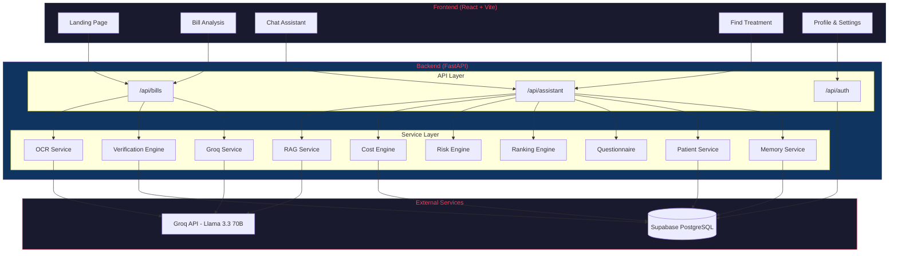
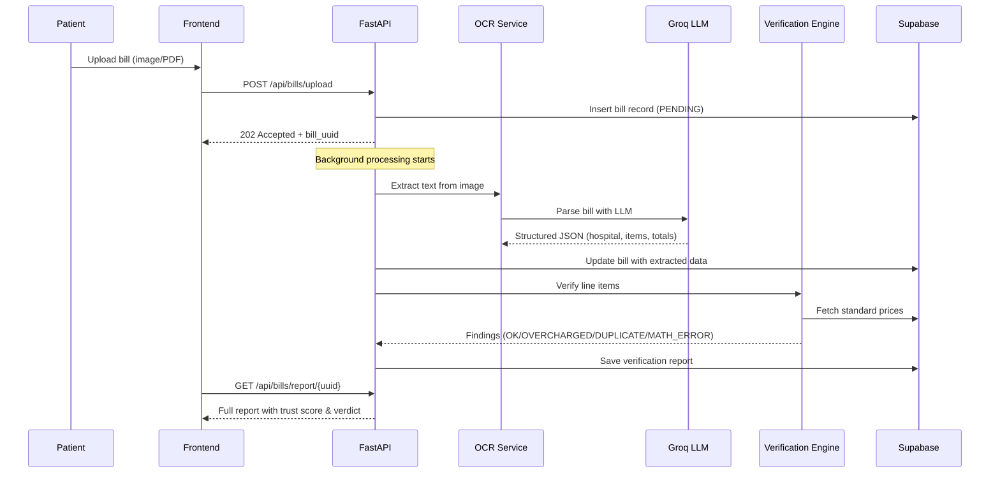
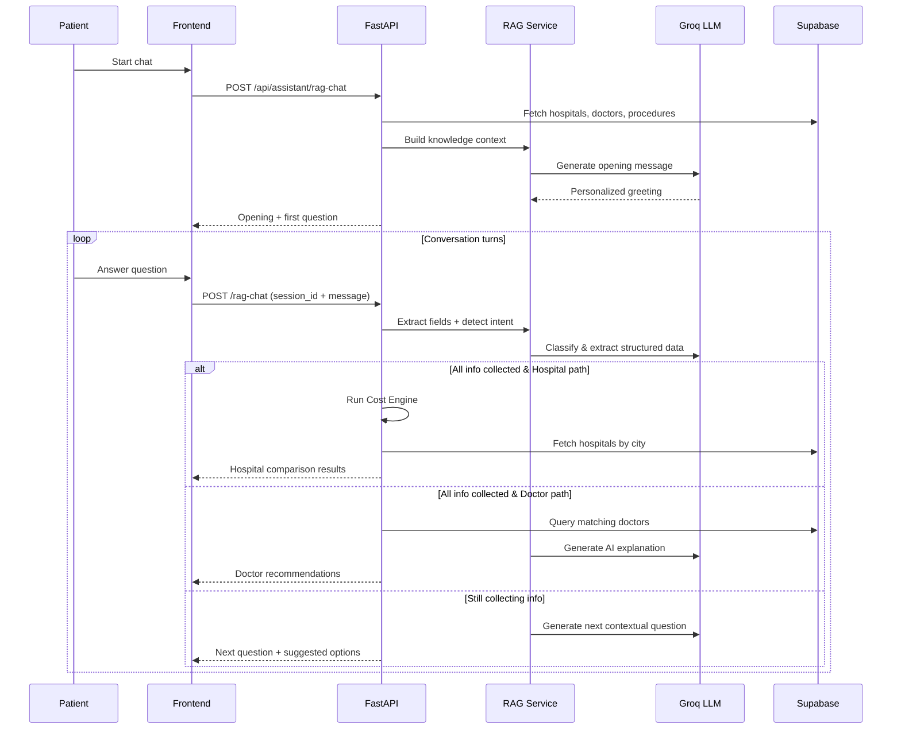
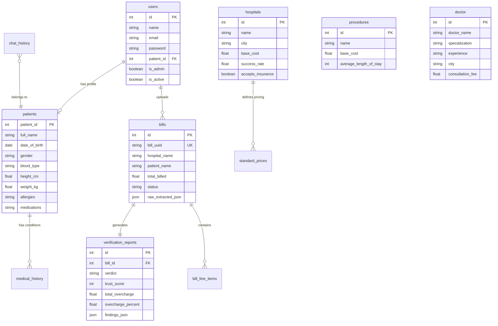

<p align="center">
  
</p>

<h1 align="center">🏥 HealthClear</h1>

<p align="center">
  <strong>AI-Powered Healthcare Cost Transparency & Bill Verification Platform</strong>
</p>

<p align="center">
  <a href="#-features">Features</a> •
  <a href="#-architecture">Architecture</a> •
  <a href="#-tech-stack">Tech Stack</a> •
  <a href="#-getting-started">Getting Started</a> •
  <a href="#-api-reference">API Reference</a> •
  <a href="#-database-schema">Database</a> •
  <a href="#-contributors">Contributors</a>
</p>

<p align="center">
  
  
  
  
  
  
  
</p>

---

## 🚀 Overview

**HealthClear** is a full-stack AI platform that brings transparency to healthcare costs in India. It combines bill verification, AI-powered cost estimation, doctor/hospital recommendations, and a conversational health assistant — all in a single, beautiful interface.

### The Problem

> Patients in India often receive hospital bills with hidden overcharges, duplicate entries, and inflated prices — with no easy way to verify them. Finding affordable, quality healthcare is an opaque, frustrating process.

### Our Solution

HealthClear uses AI (Groq Llama 3.3 70B) and a verified database of standard medical prices to:

- 🔍 **Scan & verify** hospital bills line-by-line against fair market rates
- 💬 **Chat** with an AI health assistant that triages symptoms and recommends doctors or hospitals
- 📊 **Compare** hospitals by cost, success rate, insurance coverage, and value score
- 🛡️ **Protect** patients with trust scores, fraud detection, and actionable dispute guidance

---

## ✨ Features

### 1. 📄 AI Bill Verification & Fraud Detection

Upload any hospital bill (image or PDF) and get an instant AI-powered verification report.

<p align="center">
  
</p>

**How it works:**

| Step | Description |
|------|-------------|
| 📤 Upload | Patient uploads a bill (JPG, PNG, PDF) |
| 🔬 OCR Extraction | Groq AI extracts hospital name, patient info, and every line item |
| ⚖️ Verification | Each item is fuzzy-matched against standard prices (±10% tolerance) |
| 🔢 Math Check | Validates qty × unit_price = total_price (₹1 tolerance) |
| 🔄 Duplicate Detection | Flags identical items billed twice |
| 📊 Trust Score | 0–100 score calculated from overcharges, duplicates, and math errors |
| 🏷️ Verdict | **CLEAN** / **SUSPICIOUS** / **FRAUDULENT** with actionable recommendations |

---

### 2. 🤖 AI Health Assistant (RAG Chatbot)

A conversational AI that understands your symptoms, triages your condition, and finds the right doctor or hospital.

<p align="center">
  
</p>

**Capabilities:**

- 🩺 **Symptom Triage** — AI determines if you need a GP, specialist, or hospital admission
- 💊 **Prior Consultation Tracking** — Asks about previous doctor visits and whether treatment helped
- 🏥 **Smart Recommendations** — Branches into hospital or doctor path based on condition severity
- 🧠 **RAG-Powered** — Uses your medical profile + hospital/doctor database as context
- 🎯 **Dynamic Questionnaire** — LLM decides what to ask next (no hardcoded questions)
- 📋 **Clickable Options + Free Text** — Patients can click buttons or type naturally

---

### 3. 🏥 Personalized Hospital Comparison

Get side-by-side hospital comparisons with personalized costs based on your risk profile.

<p align="center">
  
</p>

**Cost Engine Formula:**

```
Personalized Cost = Base Procedure Cost × (1 + Risk Factor) + (Length of Stay × Room Cost/Day)

Risk Factor = f(age, comorbidities, smoking status)

Value Score = f(success_rate, personalized_cost, adjusted_complication_rate)
```

**Insurance Support:**

| Type | Coverage Logic |
|------|---------------|
| 🏛️ Government (Ayushman Bharat / PMJAY) | 100% up to ₹5,00,000 cap |
| 🏢 Private Insurance | 70% coverage |
| ❌ No Insurance | Full out-of-pocket with EMI guidance |

---

### 4. 👨‍⚕️ Doctor Recommendations

When surgery isn't needed, the AI finds the best specialist based on your symptoms, city, budget, and preferences.

- Searches by specialization + city with fuzzy matching
- Displays consultation fees, experience, clinic details
- AI-generated explanation of why each doctor was recommended

---

### 5. 📱 Additional Features

| Feature | Description |
|---------|-------------|
| 🔐 **User Auth & Onboarding** | Register, login, and create a medical profile |
| 📋 **Medical Profile** | Store allergies, medications, blood type, conditions |
| 💰 **Find Treatment** | Search and compare providers across cost and ratings |
| 🛏️ **ICU Bed Finder** | Real-time ICU bed availability tracker |
| 💸 **Medical Fundraisers** | Community fundraising for medical expenses |
| 💊 **Medical Deals** | Discounted healthcare services and packages |
| ⚙️ **Settings** | Personalization and notification preferences |

---

## 🏗️ Architecture



### Data Flow — Bill Verification Pipeline



### Data Flow — AI Assistant (RAG Chat)



---

## 🛠️ Tech Stack

### Backend

| Technology | Purpose |
|-----------|---------|
| **FastAPI** | High-performance async Python API framework |
| **Uvicorn** | ASGI server with hot-reload |
| **Supabase** | PostgreSQL database + auth + real-time |
| **Groq (Llama 3.3 70B)** | LLM for OCR, triage, RAG, cost estimation |
| **LangChain** | LLM orchestration (ChatGroq, message types) |
| **Pillow** | Image processing for bill uploads |
| **PyPDF2** | PDF text extraction |
| **python-dotenv** | Environment variable management |

### Frontend

| Technology | Purpose |
|-----------|---------|
| **React 19** | UI component library |
| **Vite 8** | Lightning-fast dev server & build tool |
| **React Router 7** | Client-side routing |
| **Framer Motion** | Smooth animations & transitions |
| **Lucide React** | Beautiful icon library |
| **Vanilla CSS** | Custom glassmorphism design system |

### Infrastructure

| Technology | Purpose |
|-----------|---------|
| **Supabase** | Managed PostgreSQL + Row Level Security |
| **Groq Cloud** | Ultra-fast LLM inference (Llama 3.3 70B) |
| **GitHub Actions** | CI/CD pipeline |

---

## 🚀 Getting Started

### Prerequisites

- **Python 3.12+**
- **Node.js 18+**
- **Supabase account** ([supabase.com](https://supabase.com))
- **Groq API key** ([console.groq.com](https://console.groq.com))

### 1. Clone the Repository

```bash
git clone https://github.com/irfanshaikh911/HealthClear.git
cd HealthClear
```

### 2. Set Up the Database

1. Create a new Supabase project
2. Open the **SQL Editor** in your Supabase dashboard
3. Run [`backend/create_tables.sql`](backend/create_tables.sql) to create all tables

### 3. Backend Setup

```bash
cd backend

# Create and activate virtual environment
python -m venv .venv
# Windows:
.venv\Scripts\activate
# macOS/Linux:
source .venv/bin/activate

# Install dependencies
pip install -r requirements.txt

# Create .env file
cp .env.example .env
# Edit .env with your actual keys:
#   GROQ_API_KEY=your_groq_api_key
#   PUBLIC_SUPABASE_URL=https://your-project.supabase.co
#   PUBLIC_SUPABASE_PUBLISHABLE_DEFAULT_KEY=your_anon_key

# Start the server
uvicorn app.main:app --host 127.0.0.1 --port 8000 --reload
```

> 📝 The server will auto-seed reference data (hospitals, procedures, risk conditions) on first startup.

### 4. Frontend Setup

```bash
cd frontend

# Install dependencies
npm install

# Create .env file
cp .env.example .env
# Edit with your Supabase URL

# Start dev server
npm run dev
```

### 5. Open in Browser

- **Frontend:** http://localhost:5173
- **Backend API Docs:** http://localhost:8000/docs

---

## 📡 API Reference

### Bill Verification

| Method | Endpoint | Description |
|--------|----------|-------------|
| `POST` | `/api/bills/upload` | Upload a bill image/PDF for verification |
| `GET` | `/api/bills/status/{bill_uuid}` | Check processing status |
| `GET` | `/api/bills/report/{bill_uuid}` | Get full verification report |
| `GET` | `/api/bills/history` | List all past bills |

### AI Assistant

| Method | Endpoint | Description |
|--------|----------|-------------|
| `POST` | `/api/assistant/chat` | Structured questionnaire flow |
| `POST` | `/api/assistant/rag-chat` | Free-form RAG chatbot |
| `GET` | `/api/assistant/history/patient/{id}` | Patient session history |
| `GET` | `/api/assistant/history/{session_id}` | Full session conversation |

### Authentication

| Method | Endpoint | Description |
|--------|----------|-------------|
| `POST` | `/api/auth/register` | Create new account |
| `POST` | `/api/auth/login` | Login with email & password |
| `GET` | `/api/auth/me/{user_id}` | Get current user profile |
| `POST` | `/api/auth/onboarding/{user_id}` | Complete medical profile setup |

---

## 🗄️ Database Schema



---

## 📂 Project Structure

```
HealthClear/
├── backend/
│   ├── app/
│   │   ├── api/
│   │   │   ├── assistant.py      # AI chatbot endpoints (682 lines)
│   │   │   ├── auth.py           # Auth & onboarding endpoints
│   │   │   └── bills.py          # Bill upload & verification endpoints
│   │   ├── core/
│   │   │   └── config.py         # Environment config loader
│   │   ├── db/
│   │   │   └── supabase.py       # Supabase client singleton
│   │   ├── models/
│   │   │   ├── assistant_models.py
│   │   │   └── enums.py
│   │   ├── schemas/
│   │   │   ├── assistant.py      # Pydantic response schemas
│   │   │   └── bills.py
│   │   ├── services/
│   │   │   ├── bill_service.py   # OCR + extraction pipeline
│   │   │   ├── cost_engine.py    # Personalized cost calculator
│   │   │   ├── groq_service.py   # Groq LLM integration
│   │   │   ├── memory_service.py # Chat session persistence
│   │   │   ├── ocr_service.py    # Image-to-text extraction
│   │   │   ├── patient_service.py# Patient profile prefilling
│   │   │   ├── questionnaire.py  # Structured question flow
│   │   │   ├── rag_service.py    # RAG chatbot engine (1000+ lines)
│   │   │   ├── ranking_engine.py # Hospital value scoring
│   │   │   ├── risk_engine.py    # Patient risk calculator
│   │   │   ├── seed_service.py   # Auto-seed reference data
│   │   │   └── verification_engine.py # Bill fraud detection
│   │   └── main.py               # FastAPI app entry point
│   ├── create_tables.sql          # Database schema
│   ├── requirements.txt
│   └── .env.example
├── frontend/
│   ├── src/
│   │   ├── pages/
│   │   │   ├── Landing.jsx       # Hero + feature showcase
│   │   │   ├── BillAnalysis.jsx  # Bill upload & report view
│   │   │   ├── ChatAssistant.jsx # AI chatbot interface
│   │   │   ├── FindTreatment.jsx # Provider search
│   │   │   ├── Questionnaire.jsx # Guided cost estimation
│   │   │   ├── ICUBeds.jsx       # ICU bed availability
│   │   │   ├── Fundraisers.jsx   # Medical fundraising
│   │   │   ├── MedicalDeals.jsx  # Healthcare deals
│   │   │   ├── Profile.jsx       # User profile
│   │   │   ├── Settings.jsx      # App settings
│   │   │   ├── Login.jsx         # Authentication
│   │   │   └── Register.jsx      # Account creation
│   │   ├── components/
│   │   │   ├── Navbar.jsx        # Navigation bar
│   │   │   └── Layout.jsx        # Page layout wrapper
│   │   └── context/
│   │       ├── AuthContext.jsx   # Auth state management
│   │       └── ThemeContext.jsx  # Theme (dark/light) toggle
│   ├── package.json
│   └── vite.config.js
├── data/                          # Reference Excel datasets
│   ├── Doctor.xlsx
│   ├── Hospital.xlsx
│   ├── Room.xlsx
│   └── Treatment.xlsx
├── docs/
│   └── images/                    # README images
└── README.md
```

---

## 🤝 Contributors

<table>
  <tr>
    <td align="center">
      <a href="https://github.com/irfanshaikh911">
        
        <br />
        <sub><b>Irfan Shaikh</b></sub>
      </a>
      <br />
      <sub>💻 Full Stack Development</sub>
    </td>
    <td align="center">
      <a href="https://github.com/yashpotdar-py">
        
        <br />
        <sub><b>Yash Potdar</b></sub>
      </a>
      <br />
      <sub>💻 Backend & Architecture</sub>
    </td>
  </tr>
</table>

---

## 📄 License

This project is licensed under the **MIT License** — see the [LICENSE](LICENSE) file for details.

---

<p align="center">
  Made with ❤️ for transparent healthcare in India
</p>
